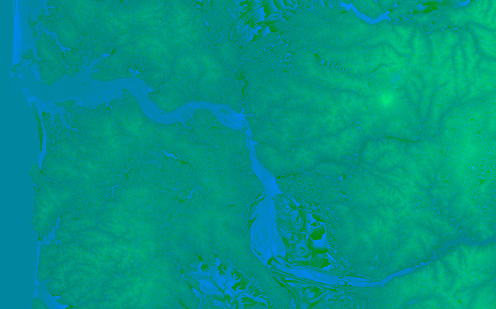

# Elevation tiles



Here we create [TerrainRGB](https://docs.mapbox.com/data/tilesets/reference/mapbox-terrain-rgb-v1/) tiles from USGS DEM source files. TerrainRGB tiles are webp image tiles that can be loaded in Maplibre-gl and dynamically rendered as hillshade, used to calculate a viewshed, or display an elevation profile across a line.

In addition to TerrainRGB tiles, we also include a method for generating contour lines from the DEM sources. While you can [generate contours on the client from TerrainRGB tiles](https://github.com/onthegomap/maplibre-contour), it's cleaner to prebuild them and serve them as vector tiles to keep things fast on the client.

We're using the [USGS seamless 1 arc-second dataset](https://www.usgs.gov/faqs/what-types-elevation-datasets-are-available-what-formats-do-they-come-and-where-can-i-download), which is medium resolution and good enough for most use cases. Each tile is about 50MB. There is a higher resolution 1/3 arc-second dataset that has tiles that are around 450MB. I haven't tried this dataset but it would likely require a very hefty machine to run the tiling process, which is already very memory intensive.

Note that this dataset is only available for North America, but if you wanted to generate tiles for other parts of the world [NASA's SRTM dataset](https://www2.jpl.nasa.gov/srtm/) would probably work well.

## Install

Ensure you've [activated the conda environment](../../README.md#building-datasets).

Create the data directories:

```
mkdir -p data/sources/ && mkdir -p data/temp/ && mkdir -p data/output/
```

## Download the elevation data

Run this script to download the elevation data for a particular bounding box from the [National Map](https://apps.nationalmap.gov/tnmaccess/#/) to `/data/sources/`:

```
python download_elevation_data.py --workers=8 --bbox="-122.04976264563147,43.51921441989123,-120.94591116755655,44.39466349563759"
```

Set `--workers` to the number of workers that should be spawned to download data in parallel and `--bbox` to the bounding box of the region for which you want data.

## Build the TerrainRGB tiles

To convert the DEM source files to TerrainRGB, we'll need to first convert them to an RGB image format. For that we'll use [rasterio](https://rasterio.readthedocs.io/en/latest/index.html) and a tool from mapbox called [rio-rgbify](https://github.com/mapbox/rio-rgbify). This tool also tiles the data, so we'll end up with a `.mbtiles` file.

### Build a virtual dataset

First, build a virtual dataset with GDAL. This allows us to use the DEMs in the tiling step below without needing to combine the source DEMs into one giant input file.

```
gdalbuildvrt -overwrite -srcnodata -9999 -vrtnodata -9999 data/temp/dem.vrt data/sources/*.tif
```

### Convert to tiled RGB images

We'll use `rgbify` to convert the DEM sources into RGB images and build a tiled `.mbtiles` file:

```
rio rgbify -b -10000 -i 0.1 --min-z 1 --max-z 12 -j 10 --format webp data/temp/dem.vrt data/output/elevation.mbtiles
```

Note that you'll want to change the number of workers in this command (`-j 10` in the example above) to an appropriate number given your machine's number of CPU cores.

> [!WARNING]
> This is an extremely memory-intensive operation if you're combining a very large set of DEM files. You will likely want to run this on a machine with as much RAM as possible.

For reference, using a bounding box around the U.S. state of Oregon (3.2 GB of DEM files), `rgbify` used about 11.2 GB of RAM (3.5x more than the sources) to create a 1.8GB `.mbtiles` file. Using a bounding box around the entire continental U.S. (112GB of DEM files), it used about 215GB of RAM and 450GB of swap to create a 27GB `.mbtiles` file.

You'll most likely need to increase your swapfile size, which is done like this on Ubuntu:

```
sudo swapoff /swapfile
# increase the swapfile size. For the continental U.S. I created a 500GB swapfile
sudo fallocate -l 16G /swapfile
sudo mkswap /swapfile
sudo swapon /swapfile
```

Note that I ran into [this issue](https://github.com/mapbox/rio-rgbify/issues/39) when running `rgbify`, with the only workaround being to manually edit the source code to remove the buggy line as [shown here](https://github.com/acalcutt/rio-rgbify/commit/6db4f8baf4d78e157e02c67b05afae49289f9ef1).

### Add metadata

`rgbify` does not add any metadata to the `.mbtiles` file beyond the bare minimum required fields. However, we'll want the bounding box coordinates included when converting to `.pmtiles`, otherwise they'll be set to 0 and the data will never be rendered.

Run this script to pull out the bounding box coordinates and add it to the `data/output/elevation.mbtiles` file metadata:

```
python add_metadata.py --input-file="data/output/elevation.pmtiles"
```

### Convert to `pmtiles`

Finally, convert to a `.pmtiles` file:

```
pmtiles convert data/output/elevation.mbtiles data/output/elevation.pmtiles
```

You should now have the final output files:

```
data/output/
    elevation.mbtiles
    elevation.pmtiles
```

## Build the contour tiles

Contours are created by iterating over the DEM source files and running `gdal_contour` to create 40ft contours for the file region as geojson. Then, we use `tippecanoe` to combine the geojson contours into tiles.

### Create contours

Run the python script to generate geojson contours for each DEM tif tile in `data/sources/`:

```
python create_contours.py --workers=8
```

Use `--workers` to specify the number of workers you want to spawn to run the processing in parallel.

### Tile contours and clean up

Next, we tile the contours and define zoom ranges at which different contour intervals should be shown. 1000 ft contours are shown from z10-z18, 200 ft contours are shown from z11-z18, and 40 ft contours are shown from z12-z18.

```
./tile_contours.sh
```

You should now have the final output files:

```
data/output/
    contours.mbtiles
    contours.pmtiles
```

## Rendering

### Hillshade

To load the TerrainRGB elevation data in Maplibre-gl as hillshade, you can load it as a new layer:

```json
{
  "type": "raster-dem",
  "url": "pmtiles://http://localhost:8080/elevation.pmtiles",
  "tileSize": 512
}
```

and render it with a style spec like this:

```json
{
  "id": "hillshade",
  "type": "hillshade",
  "source": "elevation",
  "paint": {
    "hillshade-exaggeration": 0.5,
    "hillshade-shadow-color": "#5a5a5a",
    "hillshade-highlight-color": "#FFFFFF",
    "hillshade-accent-color": "#5a5a5a",
    "hillshade-illumination-direction": 335,
    "hillshade-illumination-anchor": "viewport",
}
```

### Contours

Contours are split into different three different layers: `contours_1000`, `contours_200`, and `contours_40`. They can be loaded like this:

```json
{
  "type": "vector",
  "url": "pmtiles://http://localhost:8080/contours.pmtiles"
}
```

and rendered with a style spec like this, using 200 ft contours as an example:

```json
{
  "id": "contour_200ft",
  "type": "line",
  "source": "contours",
  "source-layer": "contour_200",
  "layout": {
    "line-join": "round",
    "line-cap": "round"
  },
  "paint": {
    "line-color": "#FF0000",
    "line-width": {
      "base": 1,
      "stops": [
        [10, 0.5],
        [20, 2]
      ]
    },
    "line-opacity": 0.8
  }
}
```
