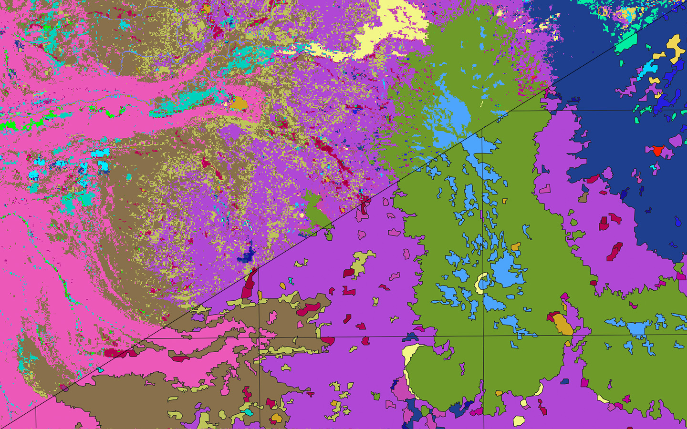

# Landcover tiles



Here we create vector landcover tiles from [USGS Landfire](https://landfire.gov/index.php) landcover classification. These are considerably more detailed than the landcover tiles you'll get from OpenStreetMap or the [National Land Cover Database](https://www.usgs.gov/centers/eros/science/national-land-cover-database). Landfire uses the [U.S. National Vegetation Classification System](https://usnvc.org/), and includes around 1,000 different vegetation classes.

## Install

Ensure you've [activated the conda environment](../../README.md#building-datasets).

Create the data directories:

```
mkdir -p data/sources/ && mkdir -p data/temp/ && mkdir -p data/output/
```

## Download landcover data

Run this script to download raster data from Landfire for a particular bounding box to `data/sources/`:

```
python download_vegetation_data.py \
  --bbox="-123.417224,43.022586,-118.980589,45.278084"
```

## Convert raster data to polygons

The raster file represents each vegetation class as a different value in the first band. Each pixel of the Landfire raster dataset is 30 meters, which results in very jagged looking areas when converted to polygons. We've built [geopolygonize](https://github.com/rainflame/geopolygonize/) to simplify and smooth the data to get a cleaner result.

To convert the raster to simplified polygons, run:

```
geopolygonize \
  --input-file="data/sources/*.tif" \
  --output-file="data/temp/combined.gpkg" \
  --smoothing-iterations=2 \
  --workers=0 \
  --label-name="class" \
  --tile-size=1000
```

## Tile

Finally, create the tiled `pmtiles` archive:

```
./tile_landcover.sh
```

## Styling

The `landcover` layer contains features with a property `label`. The label corresponds to the values found in `data/input/values.csv`. To make it easier to assign colors, pull out the annotations for the region you've created:

```
python landcover_classes_to_json.py
```

Which should yield a json with the labels and their landcover class annotations `data/output/classes.json`:

```json
{
    {
    "7125.0": {
        "name": "Inter-Mountain Basins Big Sagebrush Steppe",
        "class": "Shrubland",
        "subclass": "Mixed evergreen-deciduous shrubland",
        "color": "#bbd1b8"
    },
    "9309.0": {
        "name": "Great Basin & Intermountain Introduced Perennial Grassland and Forbland",
        "class": "Herbaceous - grassland",
        "subclass": "Perennial graminoid grassland",
        "color": "#bbd1b8"
    },
    "7153.0": {
        "name": "Inter-Mountain Basins Greasewood Flat",
        "class": "Shrubland",
        "subclass": "Evergreen shrubland",
        "color": "#bbd1b8"
    },
    "7127.0": {
        "name": "Inter-Mountain Basins Semi-Desert Shrub-Steppe",
        "class": "Shrubland",
        "subclass": "Mixed evergreen-deciduous shrubland",
        "color": "#bbd1b8"
    }
}
```

Now you can choose colors based on the features' name, class or subclass. Once you have the colors, they can be rendered in Maplibre-gl with a spec like this:

```json
 {
    id: "landcover",
    type: "fill",
    source: "basemap",
    "source-layer": "landcover",
    paint: {
      "fill-color": [
        "match",
        ["get", "label"],
        7125.0,
        "#a8b7a5",
        9309.0,
        "#99b594",
        7153.0,
        "#c1beb0",
        7127.0,
        "#97a88b",
        "#c4debf", // default for other labels
      ],
      "fill-opacity": 0.55,
    },
  },
```
