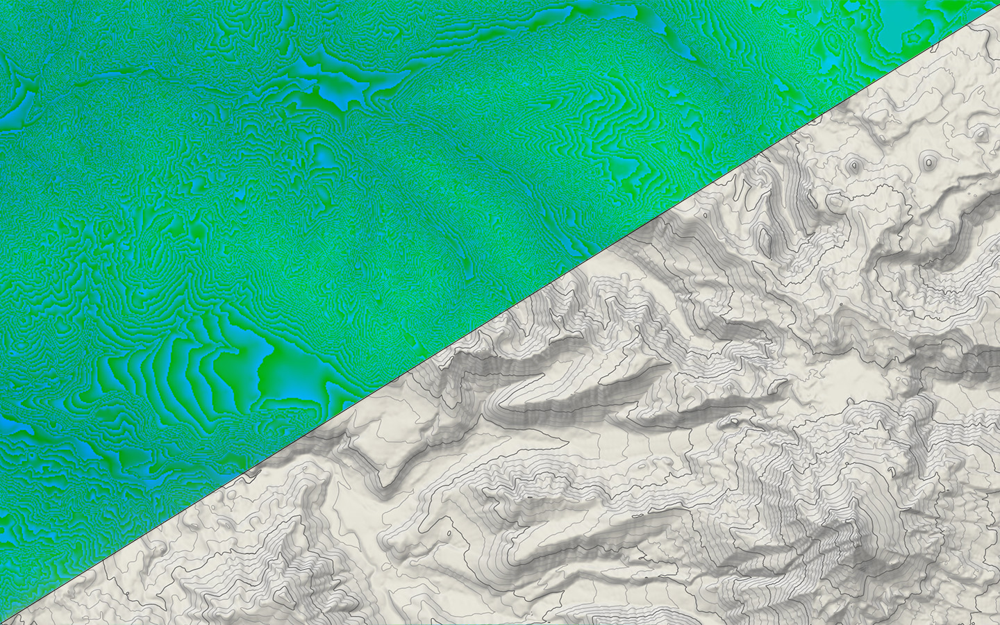

# Elevation tiles



Here we create [TerrainRGB](https://docs.mapbox.com/data/tilesets/reference/mapbox-terrain-rgb-v1/) tiles from USGS DEM source files. TerrainRGB tiles are webp image tiles that can be loaded in Maplibre-gl and dynamically rendered as hillshade, used to calculate a viewshed, or display an elevation profile across a line.

In addition to TerrainRGB tiles, we also include a method for generating contour lines from the DEM sources. While you can [generate contours on the client from TerrainRGB tiles](https://github.com/onthegomap/maplibre-contour), it's cleaner to prebuild them and serve them as vector tiles to keep things fast on the client.

We're using USGS seamless DEMS from the [National Elevation Dataset](https://www.usgs.gov/faqs/what-types-elevation-datasets-are-available-what-formats-do-they-come-and-where-can-i-download), either the 1 arc-second dataset or 1/3 arc-second dataset. Each 1 arc-second image is about 50MB and each 1/3 arc-second image is around 450MB. The 1 arc-second data is the best place to start as it's much more manageable to work with considering how RAM-heavy the following process is.

Note that this USGS dataset is only available for North America, but if you wanted to generate tiles for other parts of the world [NASA's SRTM dataset](https://www2.jpl.nasa.gov/srtm/) would probably work well.

## Install

Ensure you've [activated the conda environment](../../README.md#building-datasets).

Create the data directories:

```
mkdir -p data/sources/ && mkdir -p data/temp/ && mkdir -p data/output/
```

## Download the elevation data

Run this script to download the elevation data for a particular bounding box from the [National Map](https://apps.nationalmap.gov/tnmaccess/#/):

```
python download_elevation_data.py \
    --bbox="-123.417224,43.022586,-118.980589,45.278084" \
    --dataset="National Elevation Dataset (NED) 1/3 arc-second"
```

You should now have a series of tif files in `/data/sources`.

## Build the TerrainRGB tiles

To convert the DEM source files to TerrainRGB, we'll need to first convert them to an RGB image format. For that we'll use [rasterio](https://rasterio.readthedocs.io/en/latest/index.html) and a tool from mapbox called [rio-rgbify](https://github.com/mapbox/rio-rgbify). This tool also tiles the data, so we'll end up with a `.mbtiles` file.

### Build a virtual dataset

First, build a virtual dataset with GDAL. This allows us to use the DEMs in the tiling step below without needing to combine the source DEMs into one giant input file.

```
gdalbuildvrt \
    -overwrite \
    -srcnodata -9999 \
    -vrtnodata -9999 \
    data/temp/dem.vrt \
    data/sources/*.tif
```

### Convert to tiled RGB images

We'll use `rio-rgbify` to convert the DEM sources into RGB images and build a tiled `.mbtiles` file. You can run it manually like this:

```
rio rgbify \
    --base-val -10000 \
    --interval 0.1 \
    --min-z 1 \
    --max-z 14 \
    --workers 10 \
    --format webp \
    data/temp/dem.vrt \
    data/output/elevation.mbtiles
```

However, you will likely run into [this issue](https://github.com/mapbox/rio-rgbify/issues/39) when running `rgbify`, with the only workaround being to manually edit the source code to remove the buggy line as [shown here](https://github.com/acalcutt/rio-rgbify/commit/6db4f8baf4d78e157e02c67b05afae49289f9ef1).

I wrapped `rgbify` to fix the issue. This script does the same as above:

```
python rgbify.py \
    --min-z=1 \
    --max-z=14 \
    --workers=10 \
    --input-dataset="data/temp/dem.vrt" \
    --output-mbtiles="data/output/elevation.mbtiles
```

> [!WARNING]
> This is an extremely memory-intensive operation if you're combining a very large set of DEM files. You will likely want to run this on a machine with as much RAM as possible.

For reference, using a bounding box around the U.S. state of Oregon (3.2 GB of DEM files), `rgbify` used about 11.2 GB of RAM (3.5x more than the sources) to create a 1.8GB `.mbtiles` file. Using a bounding box around the entire continental U.S. (112GB of DEM files), it used about 215GB of RAM and 450GB of swap to create a 27GB `.mbtiles` file.

If you don't have enough RAM you can increase your swapfile size, which is done like this on Ubuntu:

```
sudo swapoff /swapfile
# increase the swapfile size. For the continental U.S. I created a 500GB swapfile
sudo fallocate -l 16G /swapfile
sudo mkswap /swapfile
sudo swapon /swapfile
```

### Add metadata

`rgbify` does not add any metadata to the `.mbtiles` file beyond the bare minimum required fields. However, we'll want the bounding box coordinates included when converting to `.pmtiles`, otherwise they'll be set to 0 and the data will never be rendered.

Run this script to pull out the bounding box coordinates and add it to the `data/output/elevation.mbtiles` file metadata:

```
python add_metadata.py \
    --input-file="data/output/elevation.mbtiles"
```

### Convert to `pmtiles`

Finally, convert to a `.pmtiles` file:

```
pmtiles convert \
    data/output/elevation.mbtiles \
    data/output/elevation.pmtiles
```

You should now have the final output files:

```
data/output/
    elevation.mbtiles
    elevation.pmtiles
```

# Contours

Contours are created by iterating over the DEM source files and running `gdal_contour` to create 40ft contours for the file region as geojson. Then, we use `tippecanoe` to combine the geojson contours into tiles.

## Run the full contour pipeline

Once you've downloaded DEMS, run all steps of the build pipeline:

```
./pipeline_contours.sh
```

## Run the pipeline steps manually

For greater control over each step of the process the pipeline can be run one command at a time.

### Create contours

Run the python script to generate geojson contours for each DEM tif tile in `data/sources/`:

```
python create_contours.py \
    --input-files="data/sources/*.tif"
```

This will create contours at 40, 200, and 1000 ft intervals in files `data/temp/contour_{interval}.gpkg`. These will all get combined together in the final version, so we need to filter out the contours that would overlap:

```
ogr2ogr \
    -f "GPKG" \
    -sql "SELECT * FROM \"elevation\" WHERE elevation % 1000 != 0" \
    "data/temp/contour_200_filtered.gpkg" \
    "data/temp/contour_200.gpkg"

ogr2ogr \
    -f "GPKG" \
    -sql "SELECT * FROM \"elevation\" WHERE elevation % 1000 != 0" \
    "data/temp/contour_40_filtered.gpkg" \
    "data/temp/contour_40.gpkg"
```

### Tile contours and clean up

Next, we tile the contours and define zoom ranges at which different contour intervals should be shown. 1000 ft contours are shown from z10-z18, 200 ft contours are shown from z11-z18, and 40 ft contours are shown from z12-z18. Pass in each contour file followed by its layer name into the tiling script:

```
./tile_contours.sh \
    data/temp/contour_40_filtered.gpkg \
    contour_40_landcover \
    data/temp/contour_200_filtered.gpkg \
    contour_200_landcover \
    data/temp/contour_1000.gpkg \
    contour_1000_landcover \
    data/output/contours.pmtiles
```

You should now have the final output files:

```
data/output/
    contours.pmtiles
```
