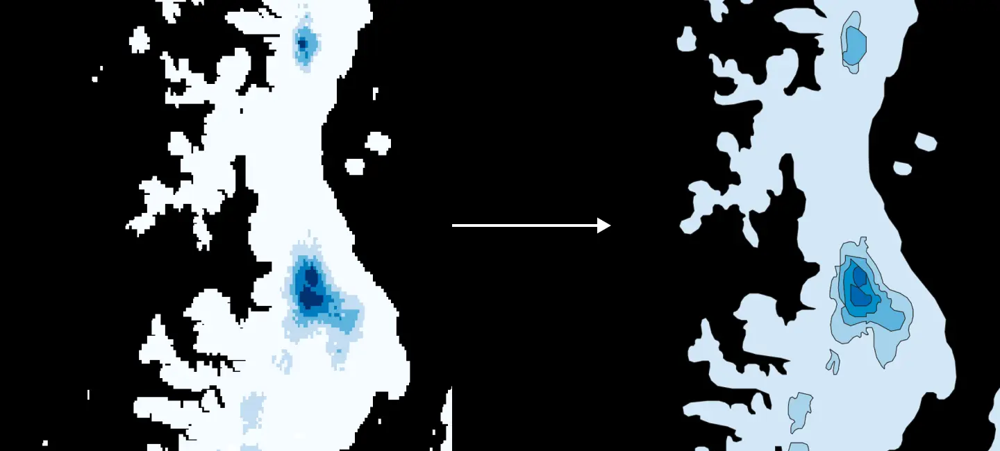

# Snow

This layer represents an estimate of the current snow depth. Data is sourced from [SNODAS](https://nsidc.org/data/g02158/versions/1), a dataset for the continental United States that's updated daily.

For Pika Maps, we have a cronjob that runs this build pipeline once a day and integrates the new snow layer into the basemap.

## Install

Ensure you've [activated the conda environment](../../README.md#building-datasets).

Create the data directories:

```
mkdir -p data/sources/ && mkdir -p data/temp/ && mkdir -p data/output/
```

## Download data

First, we download the snowcover data and transform it into GeoTIFF format. Pass in the date for which to download the data in the format `%Y%m%d%b`. For example, to get data for the current UTC date:

```
./download_snow.sh "$(date -u +'%Y%m%d%b')"
```

Or to get yesterday's data (GNU Linux only):

```
./download_snow.sh "$(date -u --date="yesterday" +'%Y%m%d%b')"
```

MacOS/BSD version:

```
./download_snow.sh "$(date -u -v-1d +'%Y%m%d%b')"
```

When complete you should have the latest snowcover data at `data/sources/snow-conus.tif` and metadata at `data/output/snow-meta.json`.

## Run the full pipeline

To run all steps of the build pipeline with defaults:

```
./pipeline.sh <bbox>
```

## Run the pipeline steps manually

For greater control over each step of the process the pipeline can be run one command at a time.

### Quantize


To begin, we quantize the raster data to produce cleaner contours. This process converts each value of the input data into its nearest bucket. For example, assuming a bucket size of 6 inches (specified with `--bin-size` in the script below), the value 4.3 would get bucketed into 6, the value 10.9 to 12, and so on.

We can also provide a bounding box with `--bbox` to crop the dataset to a smaller region.

```
python quantize.py \
    --input-file="data/sources/snow-conus.tif" \
    --output-file="data/temp/snow-quantized.tif" \
    --bin-size=12 \
    --bbox="-123.417224,43.022586,-118.980589,45.278084"
```

Now you should have the quantized version of the snow raster at `data/temp/snow-quantized.tif`.

### Polygonize



Now we can convert the quantized raster into polygons with [geopolygonize](https://github.com/rainflame/geopolygonize/):

```
geopolygonize \
    --input-file="data/temp/snow-quantized.tif" \
    --output-file="data/temp/snow-contours.gpkg" \
    --simplification-pixel-window=1 \
    --min-blob-size=12 \
    --smoothing-iterations=1 \
    --label-name="depth"
```

If desired, remove the polygons representing a snow depth of zero:

```
ogr2ogr \
    -f GPKG \
    data/temp/snow-final.gpkg \
    data/temp/snow-contours.gpkg \
    -nln snow \
    -where "depth != 0"
```

### Tile

Finally, create the tiled `pmtiles` archive:

```
./tile_snow.sh \
    data/temp/snow-final.gpkg \
    data/output/snow.pmtiles
```
